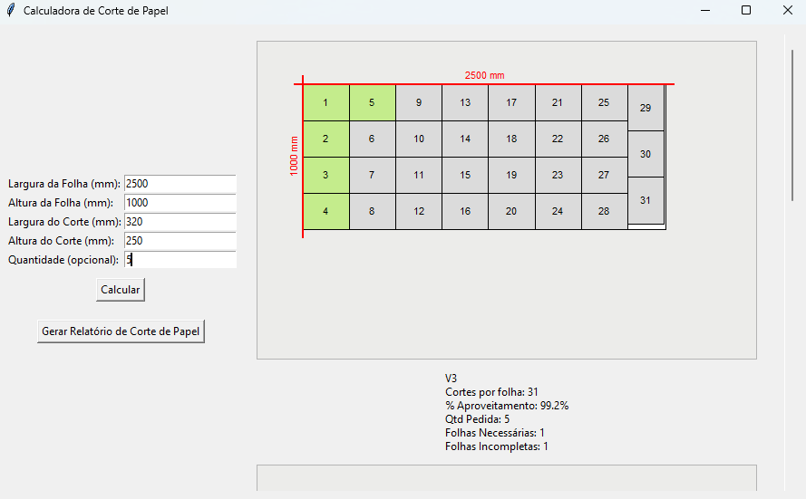
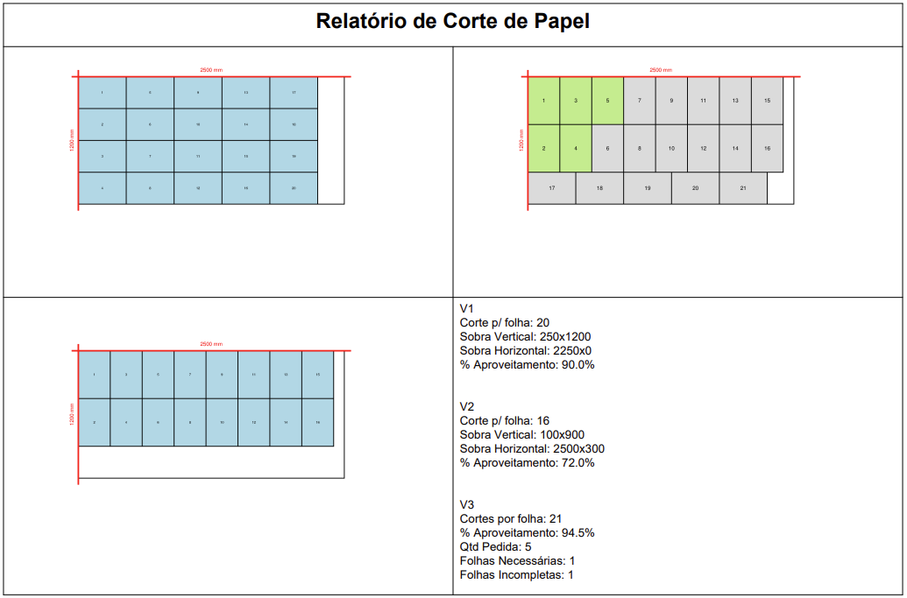

# Calculadora de Corte de Papel

Uma ferramenta desktop em Python com interface gráfica (Tkinter) para calcular arranjos de cortes em folhas de papel, visualizar layouts e gerar relatórios em PDF.

---

## Descrição

- **Entrada** de dimensões de folha (largura × altura em mm) e de corte (largura × altura em mm).
- Cálculo automático de quantos cortes cabem na folha:
  - Versão Normal (sem rotação)
  - Versão Rotacionada
  - Versão Mista (melhor aproveitamento)
- Cálculo de sobras laterais e inferiores.
- Visualização gráfica de cada arranjo em três canvas distintos.
- Exportação de relatório consolidado em PDF com as três versões e detalhes de aproveitamento.

---

## Funcionalidades

- **Interface gráfica** com campos de entrada e botões:
  - `Calcular` para atualizar visualização.
  - `Gerar Relatório de Corte de Papel` para exportar PDF.
- **Layouts desenhados** em canvas Tkinter, com marcações de dimensões e numeração dos cortes.

- **Cálculos de aproveitamento** percentual e quantidade de folhas necessárias.
- **Exportação em PDF** usando ReportLab e PIL, combinando imagens dos canvas e textos de resumo.


---

## Pré-requisitos

- Python 3.7 ou superior  
- Tkinter (geralmente incluso na instalação do Python)  
- [Pillow](https://pypi.org/project/Pillow/)  
- [ReportLab](https://pypi.org/project/reportlab/)

---

## Instalação

1. Clone este repositório:
   ```bash
   git clone https://github.com/SEU_USUARIO/calculadora-corte-papel.git
   cd calculadora-corte-papel
